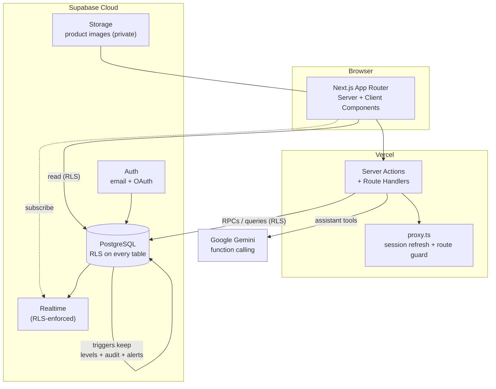

# Smart Inventory

An AI-powered, multi-tenant inventory management system for small and medium
businesses — real-time stock across warehouses, purchasing and sales with
approval workflows, demand forecasting, and a grounded AI assistant.

**Live demo:** https://smartinventorysystem-rho.vercel.app

> **Try it** — sign in with the demo account:
> `smartinventory.demo@gmail.com` / `demo-inventory-2026`
> (a sandboxed org "Bright Bazaar" with sample products, orders and 30 days of
> demand history). Or sign up / use Google to create your own organization.

---

## What it does

| Area | Highlights |
|---|---|
| **Auth & orgs** | Email + Google OAuth, multi-tenant organizations, roles (super admin, inventory manager, warehouse staff, sales executive), invitations |
| **Catalog** | Products (images, CSV import/export, barcode + QR labels), nested categories, warehouses, suppliers |
| **Inventory** | Append-only stock ledger, per-warehouse levels, transfers, mobile barcode scanner, **live** cross-session updates |
| **Orders** | Purchase orders (draft → approve → receive) and sales orders (reserve → fulfil → return) as enforced state machines |
| **Insights** | Dashboard (KPIs + charts), reports (valuation, low/dead stock, best sellers), demand forecast, CSV export |
| **Platform** | Global search, in-app notifications (realtime), immutable audit log, AI assistant |

## Architecture



**The spine of the system: the database is the enforcement layer, not the app.**
Row Level Security, triggers, and `SECURITY DEFINER` workflow functions mean the
important rules cannot be bypassed by any code path — present or future.

## Key engineering decisions

- **Stock is an append-only ledger, not a mutable column.** Every change is a row
  in `stock_movements`; a trigger maintains a derived `stock_levels` cache in the
  same transaction. This is auditable, safe under concurrent orders (no lost
  updates), and the input demand forecasting needs. On-hand can never go negative,
  and confirmed sales orders reserve stock that nothing else can consume — all
  enforced by the trigger.
- **Multi-tenancy lives in Postgres.** Every table carries `org_id` and RLS makes
  cross-tenant reads impossible even with a buggy query. Reporting views use
  `security_invoker = true` so they inherit the same guarantee. Verified by attack
  (see below), not by hope.
- **Orders are state machines with unrepresentable illegal states.** Order tables
  have *select-only* RLS; every transition is a `SECURITY DEFINER` function that
  checks role and current status. You cannot mark an unapproved PO as received or
  hand-edit a status — there is no code path that allows it.
- **The AI never writes SQL.** The assistant uses Gemini function-calling over a
  fixed set of safe, parameterised, RLS-scoped tools. Forecasting is computed
  statistically; the LLM only explains the numbers.

## Tech stack

Next.js 16 (App Router) · React 19 · TypeScript · Tailwind CSS v4 · shadcn/ui
(Base UI) · React Hook Form + Zod · TanStack-style server pagination · Recharts ·
Supabase (Postgres, Auth, Storage, Realtime) · Google Gemini · Vercel (hosting +
Analytics + Speed Insights).

## Security model

- RLS on every table; the publishable key is safe to ship — the database, not the
  key, protects the data.
- Server-side authorization re-checked in every Server Action (they are reachable
  by direct POST).
- Auth verified with `getClaims()` / `getUser()`, never the forgeable
  `getSession()`.
- Private Storage bucket with path-scoped RLS; images served via short-lived
  signed URLs.
- Append-only ledger and immutable audit log — history cannot be edited.
- Security headers (HSTS, `X-Frame-Options`, `X-Content-Type-Options`,
  `Referrer-Policy`, `Permissions-Policy`) in `next.config.ts`.

## Verification

Correctness is proven by attack-style scripts, not assumed. Each needs
`SUPABASE_SECRET_KEY` in `.env` (used only to seed/tear down throwaway test
users):

```bash
node scripts/verify-rls.mjs               # anonymous access is fully denied
node scripts/verify-tenant-isolation.mjs  # two orgs cannot reach each other's data
```

Additional invariants verified during development (see git history): ledger sum ==
cache sum, non-negative and reservation enforcement, atomic transfers, order
state-machine legality, audit immutability, realtime RLS isolation, and search
isolation.

## Local setup

```bash
git clone https://github.com/govindprabhu03/AI-Powered-Inventory-Management-System.git
cd AI-Powered-Inventory-Management-System
npm install
cp .env.example .env          # fill in your Supabase (and optional Gemini) values
npx supabase link --project-ref <your-ref>
npx supabase db push          # apply all migrations
npm run dev
```

Optional: `node scripts/seed-demo.mjs` populates a demo organization.

## Project structure

```
src/
  app/(auth)/        login, signup, password reset
  app/(app)/         the signed-in application (dashboard, stock, products,
                     orders, reports, assistant, audit, …)
  app/auth/callback  OAuth / email confirmation handler
  components/        UI + feature components (shadcn/ui in components/ui)
  lib/
    supabase/        browser + server clients, proxy session refresh
    auth/            requireContext() — per-request user + active org
    validation/      Zod schemas shared by forms and Server Actions
    data/            server-only data helpers
    ai/              Gemini client + the assistant's fixed toolset
    forecast.ts      pure statistical forecasting
supabase/migrations/ the entire schema, in order, as reviewable SQL
scripts/             verification + demo-seed scripts
NOTES.md             study notes on the concepts used
```

## License

Portfolio project. Not licensed for production use as-is.
